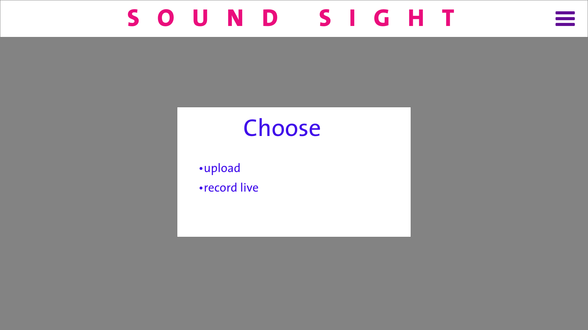
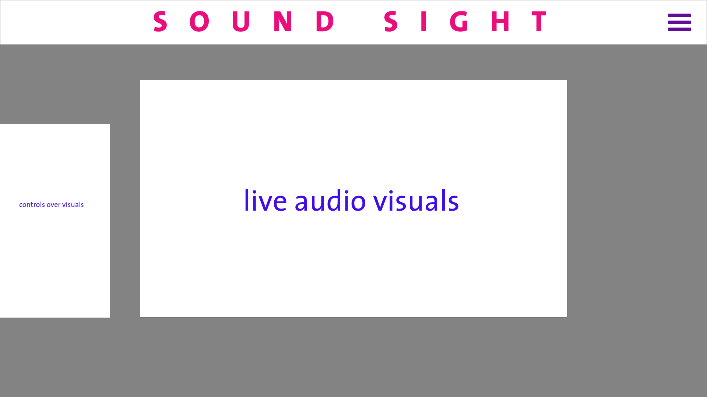

# Sound Sight

## Background and Overview

<em>Explore the beauty of your sound</em>

Sound Sight is an interactive audio-visual tool that allows you explore audio visual connections. With Sound Sight you can visualize your audio data, either recorded live or loaded through audio file upload. Sound Sight additionally allows a user to modify qualities of preloaded audio input through equalizer controls.

## Functionality and MVPs

With Sound Sight users will be able to:

- [ ] Record live audio
- [ ] View visualizations rendered based on live audio
- [ ] Cycle between options of visualization
- [ ] Optionally load audio files in to be visualized
- [ ] Affect the features of preloaded audio through an equalizer interface
- [ ] Record video of the visualizations

## Wireframes

### Home screen

### Live Audio Input

### Preloaded Audio Input

## Architecture and Technology

This project will be implemented using the following technologies:

- `HTML` and `CSS`
- `Javascript`, specifically using the `Web Audio API` to interface with audio inputs
- `HTML Canvas` for rendering visuals

## Implementation Timeline

### Day 1

- Research `Web Audio API` as well as necessary features of `HTML Canvas`
- Arrive at a point where I have access to audio data using either live audio

### Day 2

- Begin structuring the site
- Make decisions about the appearance of aesthetics of visualizations and begin implementation
- Begin implementing audio file upload + analysis

### Day 3

- Add in equalizer for inputted audio files
- Add video recorder

### Day 4

- Potential Debugging
- Entire site styling

### Day 5

- Final Styling
- Production README

## Bonus Features

- Further visual customization (more depictions of audio)
- Live concert mode, friends can join
- Integration with Spotify/other online audio APIs
